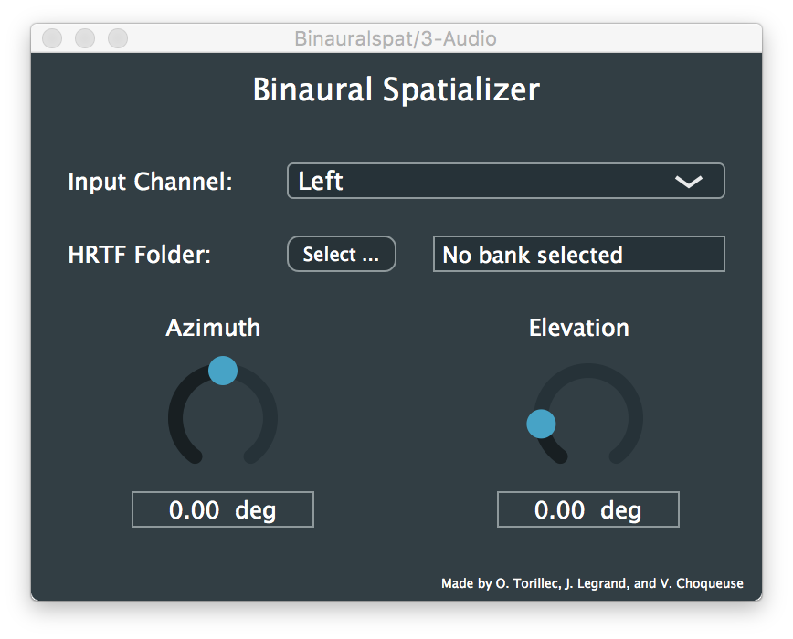

# BINAURAL SPATIALIZER (VST plugin)

The binaural spatializer is a VST plugin for 3D sound spatialization. This plugin uses the Head Related Transfer Function (HRTFs) of the CIPIC HRTF database and the JUCE Framework.

* Dowload VST, VST3, AU version: 

## Demo

## Contributors

* Olivier Torillec
* Julien Legrand
* Vincent Choqueuse
